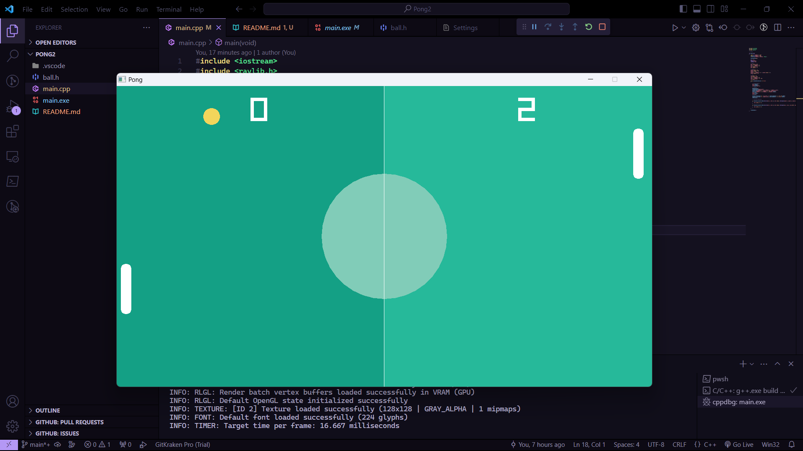

# Pong Game Made in C++ with Raylib

This is my first ever game made in C++ with the Raylib library. This is the first of many games to come (hopefully) as a widen my knowlwdge of C++, Raylib and game dev in general.
